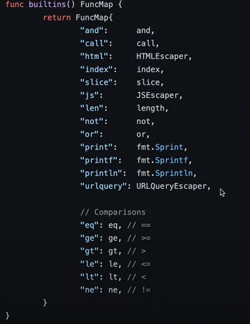
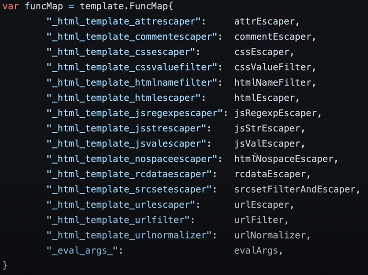
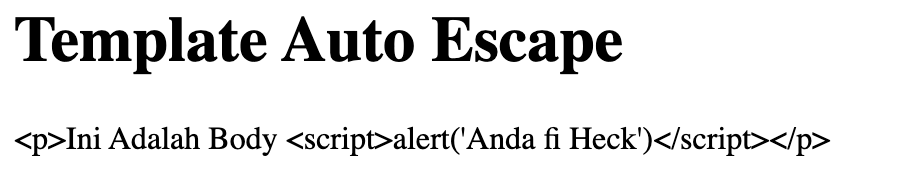
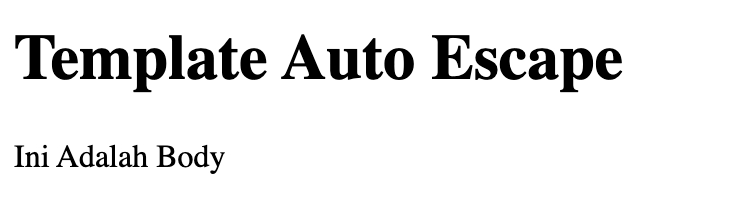

# Belajar Golang Web

Link Pembelajaran <a href="https://www.youtube.com/watch?v=fXtcZYE4_xI&list=PL-CtdCApEFH-0i9dzMzLw6FKVrFWv3QvQ&index=10&ab_channel=ProgrammerZamanNow">Programmer Zaman Now</a>

> cara membuat server `ListenAndServe()`

```golang
server := http.Server {
  Addr: "localhost:8080",
}

err := server.ListenAndServe()
if err != nil {
  t.Error(err)
}
```

dengan begitu sudah jalan di `http://localhost:8080`

> Handler

```golang
func TestHandler(t *testing.T)  {
	var handler http.HandlerFunc = func(w http.ResponseWriter, r *http.Request) {
		fmt.Fprint(w, "Hello, world!")
	}

	server := http.Server {
		Addr: ":8080",
    Handler: handler,
	}

	err := server.ListenAndServe()
	if err!= nil {
		panic(err)
  }
}
```

> ServeMux

```golang
mux := http.NewServeMux()

mux.HandleFunc("/", func(w http.ResponseWriter, r *http.Request) {
  fmt.Fprint(w, "Hello, world!")
})
mux.HandleFunc("/hi", func(w http.ResponseWriter, r *http.Request) {
  fmt.Fprint(w, "Hi!")
})
```

> Request

```golang
var handler http.HandlerFunc = func(w http.ResponseWriter, r *http.Request) {
  fmt.Fprint(w, r.Method)
  fmt.Fprint(w, r.RequestURI)
}
```

> Http Testing

Dengan adanya httptest makan kita dapat ngetest endpoint kita tampa perlu menjalankan server kita hanya cukup menjalankan test yang kita buta

```golang
func HelloHandler(w http.ResponseWriter, r *http.Request)  {
	fmt.Fprint(w, "Hello World!")
}

func TestHelloHandler(t *testing.T)  {
	req := httptest.NewRequest("GET", "http://localhost:8080/hello", nil)
	rec := httptest.NewRecorder()

	HelloHandler(rec, req)

	res := rec.Result()
	defer res.Body.Close()

	body, _ := io.ReadAll(res.Body)

	bodyStr := string(body)
	fmt.Println(bodyStr)
}
```

berikut adalah contoh code dimana saya dapat ngecek `body` maupun `method` yang gunakan. menggunakan `httptest.NewRecorder()` sebagai penyimpang proses yang berlangsung dan `httptest.NewRequest()` untuk nge hit endpoint yang kita mau.

> Query Param

cara mengambil `Query param` di golang dengan menggunakan `req.URL.Query().Get("{nama parameter}")`

```golang
req := httptest.NewRequest(http.MethodGet, "http://localhost:8080/hello?name=naim", nil)
rec := httptest.NewRecorder()

SayHello(rec, req)

// func Sayhello()
func SayHello(w http.ResponseWriter, req *http.Request)  {
	name := req.URL.Query().Get("name")
	if name == "" {
		fmt.Fprint(w, "Hello")
	} else {
		fmt.Fprintf(w, "Hello %s", name)
	}
}
```

> Get multiple Query parameter

```golang
req := httptest.NewRequest(http.MethodGet, "http://localhost:8080/hello?first_name=abrar&last_name=naim", nil)

firstName := req.URL.Query().Get("first_name")
lastName := req.URL.Query().Get("last_name")
```

penggunaan `&` untuk query param yang lebih dari 1 contoh `/hello?first_name=abrar&last_name=naim`

> Multiple Parameter Values

untuk mengambil semua value dengan parameter yang sama contoh pada url `/hello?name=abrar&name=naim`

```golang
req := httptest.NewRequest(http.MethodGet, "http://localhost:8080/hello?name=abrar&name=naim", nil)
query := r.URL.Query()
names := query["name"] // ["abrar", "naim"]
fmt.Fprint(w, strings.Join(names, " ")) // -> "abrar naim"
```

> Get Header Data

cara untuk memasukan data ke header `req.Header.Add()` dan cara mengabil data header `res.Header.Get("x-power-by")`

```golang
func responseHeader(w http.ResponseWriter, r *http.Request)  {
	w.Header().Add("X-Power-By", "Naim")
	fmt.Fprint(w, "OK")
}

func TestResponseHeader(t *testing.T)  {
	req := httptest.NewRequest(http.MethodPost, "http://localhost:8080/", nil)
	rec := httptest.NewRecorder()

	req.Header.Add("Content-Type", "application/json")

	responseHeader(rec, req)
	res := rec.Result()

	body, _ := io.ReadAll(res.Body)

	fmt.Println(string(body))
	fmt.Println(res.Header.Get("x-power-by"))
}
```

> Get Data Body

pada testting cara agar kita dapat memasukan data kedalam body req kita, kita dapat menggunakan cara `strings.NewReader()` dan kita harus menambahakan `application/x-www-form-urlencoded` ke dalam `header` agar format body kita dapat terbaca

```golang
// memasukan data ke body request
reqBody := strings.NewReader("first_name=Abrar&last_name=Naim")

// request yang kita buat dan letakan req body di akhir
req := httptest.NewRequest(http.MethodPost, "http://localhost:8080/crateuser", reqBody)

// tambahkan header format
req.Header.Add("Content-Type", "application/x-www-form-urlencoded")

// data body hasur di parse
err := r.ParseForm()

// mengambil data body
firstName := r.PostForm.Get("first_name")
lastName := r.PostForm.Get("last_name")

// bisa tampa di parse dengan cara
r.PostFormValue("first_name")
```

> Status Code

alias name <a href="https://github.com/golang/go/blob/master/src/net/http/status.go">STATUS</a> code di goalng

```golang
// exp
const (
	StatusOK                   = 200 // RFC 9110, 15.3.1
	StatusCreated              = 201 // RFC 9110, 15.3.2
	StatusAccepted             = 202 // RFC 9110, 15.3.3

	StatusBadRequest                   = 400 // RFC 9110, 15.5.1
	StatusUnauthorized                 = 401 // RFC 9110, 15.5.2
	StatusPaymentRequired              = 402 // RFC 9110, 15.5.3
	StatusForbidden                    = 403 // RFC 9110, 15.5.4
	StatusNotFound                     = 404 // RFC 9110, 15.5.5

	StatusInternalServerError           = 500 // RFC 9110, 15.6.1
)
```

```golang
// set status code
w.WriteHeader(400)
w.WriteHeader(http.StatusBadRequest) // 400

w.WriteHeader(200)
w.WriteHeader(http.StatusOK)

// get status code
fmt.Println(res.Status) // 200 OK
fmt.Println(res.StatusCode) // 200

fmt.Println(res.Status) // 400 Bad Request
fmt.Println(res.StatusCode) // 400
```

> Cookie

cara nge set cookie `http.setCookie()` cookie dapat di gunakan unutuk menyimpan data user di client, contoh seperti token dll

untuk mamasukan cookie bisa menggunakan `req.AddCookie()`

```golang
cookie := new(http.Cookie)
cookie.Name = "X-PZN-Name"
cookie.Value = "Abrar-naim"
req.AddCookie(cookie)

body, _ := io.ReadAll(rec.Result().Body)
```

```golang
func SetCookie(w http.ResponseWriter, r *http.Request)  {
	cookie := new(http.Cookie)

	cookie.Name = "X-PZN-Name"
	cookie.Value = r.URL.Query().Get("name")
	cookie.Path = "/"

	http.SetCookie(w, cookie)
	fmt.Fprint(w, "Success Create Cookie")
}

func GetCookie(w http.ResponseWriter, r *http.Request)  {
	cookie, err := r.Cookie("X-PZN-Name")
	if err != nil {
		fmt.Fprint(w, "No Cookie")
	} else {
		name := cookie.Value
		fmt.Fprintf(w, "Hello %s", name)
	}
```

> File Server

berguna untuk nge rander file yang ada di directory kita
untuk cara pembuatannya dapat menggunakan `http.Dir(lokasi folder/file)` kemudia kita pasti bakal membuat endpoint untuk fungsi ini, contoh `/static/`, dan kita harus menambahkan `http.StripPrefix("{nama endpoint}", fileServer)` karena jika tidak menggunakan `http.StripPrefix()` maka di `http.Dir("./resources")` akan berubah menjadi `http.Dir("./resources/statc/{file yang di query}")` maka dari itu filenya tidak akan ketemu karena folder `static` tidak ada

```golang
// setup
directory := http.Dir("./resources")
fileServer := http.FileServer(directory)

// pemanggilan
mux := http.NewServeMux()
	mux.Handle("/static/", http.StripPrefix("/static", fileServer))
```

contoh end point kika kita memiliki file `index.html`, `index.css` dan `index.js` di dalam folder `resources`

```url
http://localhost:8080/static/index.html
http://localhost:8080/static/index.css
http://localhost:8080/static/index.js
```

> File Server Golang Embed

ketika sebelumnya kita mamasukan file disectory ke dalam server maka pada saat di deploy ke server maka kita harus membawa filenya ke server, maka dari itu lebih baik kita menggunakan `golang embed` agar kita tidak perlu membawa filenya ke server pada saat deploymen.

`//go:embed {folder name}`

```golang
//go:embed resources
var resources embed.FS
```

permasalahn muncul kembali pada saat end point sebelumnya, karena fungsi dari embed file `http.FS({file/folder name})` maka end point kita harus berubah menjadi `/static/resources/{file name}` sedangkan kita cuma mau `/static/{file name}` maka dari itu kita butuh menggunakan `fs.Sub()` agar tidak terjadi hal yang serupa.

pada saat menggunakan `fs.Sub({PARAM 1}, "{PARAM 2}")` param 1 dan 2 harus sama

```golang
directory, _ := fs.Sub(resources, "resources")
fileServer := http.FileServer(http.FS(directory))

mux := http.NewServeMux()
mux.Handle("/static/", http.StripPrefix("/static", fileServer))
```

> Serve File

jika kita ingin balikan dari respon http kita ada file maka kita dapat menggunakan `http.ServeFile()`, jika sebelumnya kita tidak bisa memilih file melaikan kita harus memasukannya di query request kita maka sekarang kita hanya perlu nge set file yang ingin kita jadikan response.

```golang
func ServeFile(w http.ResponseWriter, r *http.Request)  {
	if r.URL.Query().Get("name") != "" {
		http.ServeFile(w, r, "./resources/ok.html")
	} else {
		http.ServeFile(w, r, "./resources/notFound.html")
	}
}
```

> Serve File use Golang Embed

jika menggunakan golang embed maka akan jauh lebih sederhana, cukup embed file yang ingin menjadi response dan di return

```golang
//go:embed resources/ok.html
var resourceOK string

//go:embed resources/notfound.html
var resourceNotFound string

func ServeFileEmbed(w http.ResponseWriter, r *http.Request)  {
	if r.URL.Query().Get("name") != "" {
		fmt.Fprint(w, resourceOK)
	} else {
		fmt.Fprint(w, resourceNotFound)
	}
}
```

> Template HTML
> cara terbaik menggunakan template embed dari bebrbagai cara, dan format filenya yaitu `.gohtml` agar go lebih gampang membacanya.

- `template.New() <-` template string
- `template.ParseFiles() <-` mengabil per file
- `template.ParseGlob() <-` mengabil per folder
- `template.ParseFS() <-` menggunakan embed

```golang
// Temmplate Text
templateText := `<html><body>{{.}}</body></html>`
t := template.Must(template.New("SIMPLE").Parse(templateText))
t.ExecuteTemplate(w, "SIMPLE", "Hello HTML Template")

// Template by File
t := template.Must(template.ParseFiles("./templates/simple.gohtml"))
t.ExecuteTemplate(w, "simple.gohtml", "Hello HTML Template")

// Template by Folder
t := template.Must(template.ParseGlob("./templates/*.gohtml"))
t.ExecuteTemplate(w, "simple.gohtml", "Hello HTML Template")

// Template by Embed 🚀
var tempaltes embed.FS
t := template.Must(template.ParseFS(tempaltes, "templates/*.gohtml"))
t.ExecuteTemplate(w, "simple.gohtml", "Hello HTML Template")
```

> Template Data

`{{.NamaTemplate}}` untuk memanggil datanya atau penamaannya

```golang
// exp .gohtml
<head>
	<meta charset="UTF-8" />
	<meta name="viewport" content="width=device-width, initial-scale=1.0" />
	<title>{{.Title}}</title>
</head>
<body>
	<h1>{{.Name}}</h1>
	<h2>Alamat : {{.Address.Street}}</h2>
</body>

// use interface map[string]
t.ExecuteTemplate(w, "name.gohtml", map[string]interface{} {
	"Title": "Template Data Map",
	"Name": "Naim",
	"Address": map[string]interface{} {
		"Street": "Jl. Tubagus Rangin",
	},
})

// use Struct
type Address struct {
	Street string
}
type Page struct {
	Title string
	Name string
	Address Address
}

t.ExecuteTemplate(w, "name.gohtml", Page {
	Title: "Template Data Struct",
	Name: "Naim",
		Address: Address{
			Street: "Jl. Tubagus Rangin",
		},
})
```

> Template Action

- `{{if.Value}} T1 {{end}}`, jika value kosong, maka `T1` akan dieksekusi, jika kosong, tidak ada yang dieksekusi
- `{{if.Value}} T1 {{else}} T2 {{end}}`, jika value tidak kosong, maka `T1` akan dieksekusi, jika kosong, `T2` yang akan dieksekusi
- `{{if.Value}} T1 {{else if .Value2}} T2 {{else}} T3 {{end}}`, jika `Value1` kosong, maka `T1` akan dieksekusi, jika `Value2` tidak kosong, maka `T2` akan dieksekusi, jika tidak semuanya, maka `T3` akan dieksekusi

```golang
<body>
	{{if .Name}}
	<h1>Hello {{.Name}}</h1>
	{{else}}
	<h1>Hello</h1>
	{{ end }}
</body>
```

> Operator Perbandingan Template gohtml

- `eq` -> arg1 `==` arg2
- `ne` -> arg1 `!=` arg2
- `it` -> arg1 `<` arg2
- `le` -> arg1 `<=` arg2
- `gt` -> arg1 `>` arg2
- `ge` -> arg1 `>=` arg2

```golang
<body>
	{{if ge .FinalValue 80}}
	<h1>Good</h1>
	{{else if ge .FinalValue 60}}
	<h1>Nice Try</h1>
	{{else}}
	<h1>Try Again</h1>
	{{ end }}
</body>
```

> Range (perulangan) Template gohtml

```golang
<body>
	{{range $i, $el := .Hobbies}}
	<h1>Hobi ke {{$i}} : {{ $el }}</h1>
	{{else}}
	<h1>Anda tidak punya Hobi</h1>
	{{ end }}
</body>

t.ExecuteTemplate(w, "range.gohtml", map[string]interface{} {
	"Title": "Template Action Range",
	"Hobbies": []string {
		"Mambaca", "Menulis", "Bercerita",
	},
})
```

> With Action Template dan Komentar

`With` berguna untuk membuka objek di dalam interface, jika sebelumnnya kita butuh `{{.Address.Street}}` maka maka menggunakan `with` kita bisa langsung `{{.Street}}`.
dan cara pembuatan komentar bisa menggunakan `{{/* ISI KOMENTAR */}}` maka pada saat di randerpun komentar tidak akan di tampilkan

```golang
<body>
	{{/* Contoh Komentar */}}
	<h1>Name : {{.Name}}</h1>
	{{with .Address}}
		{{if .Street}}
			<h1>Address Street : {{.Street}}</h1>
		{{else}}
			<h1>Address Street : Tidak ditemukan</h1>
		{{end}}
		{{if .City}}
			<h1>Address City : {{.City}}</h1>
		{{else}}
			<h1>Address City : Tidak ditemukan</h1>
		{{end}}
	{{end}}
</body>
```

> Template Layout

Cara Import template

- `{{template"name"}}` -> kita akan meng-import template `"name"` tanpa memberikan data apapun
- `{{template"name".Value}}` -> kita akan meng-import `"name"` dengan memberikan data `value`
- `{{template"name".}}` -> memasukan semua data `value`

```golang
// header.gohtml
<head>
	<meta charset="UTF-8" />
	<meta name="viewport" content="width=device-width, initial-scale=1.0" />
	<title>{{.Title}}</title>
</head>
<body>

// footer.gohtml
</body>
</html>

// layout.gohtml
{{template "header.gohtml" .}} <- "." untuk memasukan semua data value
<h1>Hello {{.Name}}</h1>
{{template "footer.gohtml"}}

t := template.Must(template.ParseFiles(
	"./templates/header.gohtml",
	"./templates/footer.gohtml",
	"./templates/layout.gohtml",
))
t.ExecuteTemplate(w, "layout.gohtml", map[string]interface{} {
	"Title": "Template Layout",
	"Name": "Naim",
})
```

> Template Name

kita bisa menggunkan `{{define "{name_of_tempalte}"}}` untuk mendeklarasi `name`dari template, jd kita tidak perlu lagi memanggil `file` dari si template seperti `footer.gohtml` menjadi `footer` karena kita sudah deklar didalmnya menjadi `{{define "footer"}}`

kita dapat membuat 2 template dalam 1 file `.gohtml`, dan pada saat di run `"test"` tidak ke render karna yang di panggil cuma `"layout"`

```golang
{{define "layout"}}
	{{template "header" .}}
		<h1>Hello {{.Name}}</h1>
	{{template "footer"}}
{{end}}

// test
{{define "test"}}
  <h1>Test</h1>
{{end}}
```

> Template Function

- Cara mengakses `Function` sama seperti mengakses `field`, namu jika function tersebut memiliki parameter, kita bisa gunakan tambahan parameter ketika memanggil `function` di templatenya.
- `{{.FunctionName}}`, memanggil field `FunctionName` atau function`functionName()`
- `{{.FunctionName "abrar", "naim"}}`, memanggil function `FunctionName("abrar", "naim")`

```golang
type MyPage struct {
	Name string
}

func (myPage MyPage) SayHello(name string) string  {
	return "Hello " + name + ", My Name Is " + myPage.Name
}

func TemplateFunction(w http.ResponseWriter, r *http.Request)  {
	t := template.Must(template.New("FUNCTION").Parse(`{{ .SayHello "Bubdi" }}`))
	t.ExecuteTemplate(w, "FUNCTION", MyPage {
		Name: "Naim",
	})
}
```

> global Function



```golang
t := template.Must(template.New("GLOBAL").Parse(`{{ len .Name }}`))
```

coba bikin `function golbal` sendiri

```golang
func TemplateFunctionMap(w http.ResponseWriter, r *http.Request)  {
	t := template.New("FUNCTION")
	t.Funcs(map[string]interface {} {
		"upper": func (value string) string {
			return strings.ToUpper(value)
		},
	})
	t = template.Must(t.Parse(`{{ upper .Name }}`))
	t.ExecuteTemplate(w, "FUNCTION", MyPage {
		Name: "naim",
	})
}
// membuat funtion "upper"
// result -> NAIM
```

> Function Pipelines

- hasil function bisa dikirim ke function berikutnya
- kita bisa menggunakan tanda `|`
- `{{ sayHello .Name | upper }}` -> memanggil global function `sayHello(Name)` hasil dari sayHello(Name) akan dikirim ke function `upper(hasil)`
- bisa menambahkan function pipelines lebih dari satu

```golang
func TemplateFunctionPipelines(w http.ResponseWriter, r *http.Request)  {
	t := template.New("FUNCTION")
	t.Funcs(map[string] interface {} {
		"sayHello" : func (value string) string {
			return "Hello " + value
		},
		"upper" : func (value string) string {
			return strings.ToUpper(value)
		},
		"add" : func (value string) string {
			return value + ". Im a Backend Golang Developer"
		},
	})

	template.Must(t.Parse(`{{ sayHello .Name | add | upper }}`))
	t.ExecuteTemplate(w, "FUNCTION", MyPage {
		Name: "naim",
	})
}
// result -> HELLO NAIM. IM A BACKEND GOLANG DEVELOPER
```

> Template Caching

- Sebenarnya code sebelumnya ridak `efisien`
  \*karena setiap `Handler` dopanggil kita melakukan `parsing` ulang templatenya
- karena idealnya `parsing dilakukan cuma 1 kali` diawal ketika app berjalan
- next data template akan di `caching (disimpan di memory)`, hingga kita tidak perlu melakukan parsing lg
- hal ini akan mempercepat web yang kita develop

```golang
//go:embed templates/*.gohtml
var cachingTemplates embed.FS
var myTemplates = template.Must(template.ParseFS(cachingTemplates, "templates/*.gohtml"))

func TemplateCaching(w http.ResponseWriter, r *http.Request)  {
	myTemplates.ExecuteTemplate(w, "simple.gohtml", "Hello Template Caching")
}
```

> XSS (Cross Site Scripting)

- XSS adalah salah satu `security issue`
- XSS adalah celah keamanan dimana orang bisa secara sengaja memasukan parameter yang mengandung `javascript` agar dirender oleh halam Web kita
- biasanya tujuan XSS adalah `mencuri cookie` browser pengguna yang sedang mengakses web kita
- XSS bisa menyebabkan `account` pengguna kita `diambil alih` jika tidak ditangan dengan baik

* akan tetapi `golang` sudah antisipasi itu secara otomatis

`ESCAPER data HTML`



```golang
func TemplateAutoEscape(w http.ResponseWriter, r *http.Request)  {
	myTemplates.ExecuteTemplate(w, "post.gohtml", map[string] interface {} {
		"Title": "Template Auto Escape",
		"Body": "<p>Ini Adalah Body <script>alert('Anda di Heck')</script></p>",
	})
}
```

Result diterminal

```html
<h1>Template Auto Escape</h1>
&lt;p&gt;Ini Adalah Body &lt;script&gt;alert(&#39;Anda fi
Heck&#39;)&lt;/script&gt;&lt;/p&gt;
```

Result di browser


maka scrip yang dimasukan sudah aman karna di `Escape` oleh golang

Namun kita jg dapa nge `Disabled Escape` auto nya denga cata

- `template.HTML` -> untuk HTML
- `template.CSS` -> untuk CSS
- `template.JS` -> untuk javascript

```golang
func TemplateAutoEscapeDisabled(w http.ResponseWriter, r *http.Request)  {
	myTemplates.ExecuteTemplate(w, "post.gohtml", map[string] interface {} {
		"Title": "Template Auto Escape",
		"Body": template.HTML("<p>Ini Adalah Body</p>"),
	})
}
```

result diterminal

```html
<body>
  <h1>Template Auto Escape</h1>
  <p>Ini Adalah Body</p>
</body>
```

Result Browser


Pada saat kita matikan `Auto Escape` maka kita kan rentan terkena masalah `XSS`

MAKA PASTIKAN BENAR-BENAR KITA PERCAYA DARI SUMBER DATA YANG KITA `MATIKAN` DI `AUTO ESCAPE`NYA

> Redirect

Dokumentasinya ada di <a href="https://developer.mozilla.org/en-US/docs/Web/HTTP/Redirections">SINI</a>

- 301 -> Moved Permanently
- 308 -> Permanent Redirect

```golang
func RedirectTo(w http.ResponseWriter, r *http.Request)  {
	fmt.Fprint(w, "Hello redirect")
}

func RedirectFrom(w http.ResponseWriter, r *http.Request)  {
	// jika ingin memasuka logic masukan di sini

	http.Redirect(w, r, "/redirect-to", http.StatusTemporaryRedirect) // 307
}

func RedirectOut(w http.ResponseWriter, r *http.Request)  {
	http.Redirect(w, r, "https://www.google.com", http.StatusTemporaryRedirect) // 307
}
```

> MultiPart file / Upload file

`r.ParseMultipartForm(32 << 20)` <- default `32` MB if wanna upper can change to `(100 << 20)` so now is max `100` MB max file.

Upload file

```golang
func Upload(w http.ResponseWriter, r *http.Request)  {
	file, fileHeader, err := r.FormFile("file") <- `Upload file`
	if err != nil {
		panic(err)
	}
	fileDestination, err := os.Create("./resources/" + fileHeader.Filename) <- `save place`
	if err != nil {
		panic(err)
	}

	_, err = io.Copy(fileDestination, file) <- `func copy file and place file`
	if err != nil {
		panic(err)
	}

	name := r.PostFormValue("name") <- `get the name`
	myTemplates.ExecuteTemplate(w, "upload-success", map[string] interface {} {
		"Name": name,
		"File": "/static/" + fileHeader.Filename,
	}) <- `just for redirect if success upload file`
}
```

Make unittest for Upload file

```golang
//go:embed resources/big_man.png
var uploadFileTest []byte
func TestUploadFIle(t *testing.T)  {
	body := new(bytes.Buffer)

	w := multipart.NewWriter(body)
	w.WriteField("name", "Abrar Naim")
	file, _ := w.CreateFormFile("file", "UNITTEST-UPLOAD-FILE.png")
	file.Write(uploadFileTest)
	w.Close()

	req := httptest.NewRequest(http.MethodPost, "http://localhost:8080/upload", body)
	req.Header.Set("Content-Type", w.FormDataContentType())
	rec := httptest.NewRecorder()

	Upload(rec, req)

	bodyResponse, _ := io.ReadAll(rec.Result().Body)
	fmt.Println(string(bodyResponse))
}
```

> Download File

- `Content-Disposition: Inline` <- reander at browser
- `Content-Disposition: attachment` <- Download not reander
- `Content-Disposition: attachment; filename="{{name file}}"` <- Download and set name file

```js
http://localhost:8080/?file=UNITTEST-UPLOAD-FILE.png
```

```golang
func DownloadFile(w http.ResponseWriter, r *http.Request)  {
	fileName := r.URL.Query().Get("file")
	if fileName == "" {
		w.WriteHeader(http.StatusBadRequest)
		fmt.Fprint(w, "BAD REQUEST")
		return
	}
	w.Header().Add("Content-Disposition", "attachment; filename=\""+fileName+"\"")
	http.ServeFile(w, r, "./resources/"+fileName)
}
```


> Middleware

```golang
// Middleware
type LogMiddleware struct {
	Handle http.Handler
}
func (middleware *LogMiddleware) ServeHTTP(w http.ResponseWriter, r *http.Request)  {
	fmt.Println("Before Execute Handler")
	middleware.Handle.ServeHTTP(w, r)
	fmt.Println("After Execute Handler")
}
```

```golang
// Error handler
type ErrorHandler struct {
	Handle http.Handler
}
func (errorHandler *ErrorHandler) ServeHTTP(w http.ResponseWriter, r *http.Request)  {
	defer func ()  {
		err := recover()
		if err != nil {
			fmt.Println("RECOVER : ", err)
			w.WriteHeader(http.StatusInternalServerError)
			fmt.Fprintf(w, "ERROR : %s", err)
		}
	} ()

	errorHandler.Handle.ServeHTTP(w, r)
}
```

```golang
// Implementation
logMiddleware := new(LogMiddleware)
logMiddleware.Handle = mux

errorHandler := &ErrorHandler {
	Handle: logMiddleware,
}

server := http.Server {
	Addr: ":8080",
	Handler: errorHandler,
}
```

> Routing Library

- <a href="https://github.com/julienschmidt/httprouter">HttpRouter</a>
- <a href="https://github.com/gorilla/mux">Gorilla Mux</a>
- <a href="https://github.com/julienschmidt/go-http-routing-benchmark">Routing Banchmark</a>

Tested routers & frameworks:

- Beego
- go-json-rest
- Denco
- Gocraft Web
- Goji
- Gorilla Mux
- http.ServeMux
- HttpRouter
- HttpTreeMux
- Kocha-urlrouter
- Martini
- Pat
- Possum
- R2router
- TigerTonic
- Traffic
